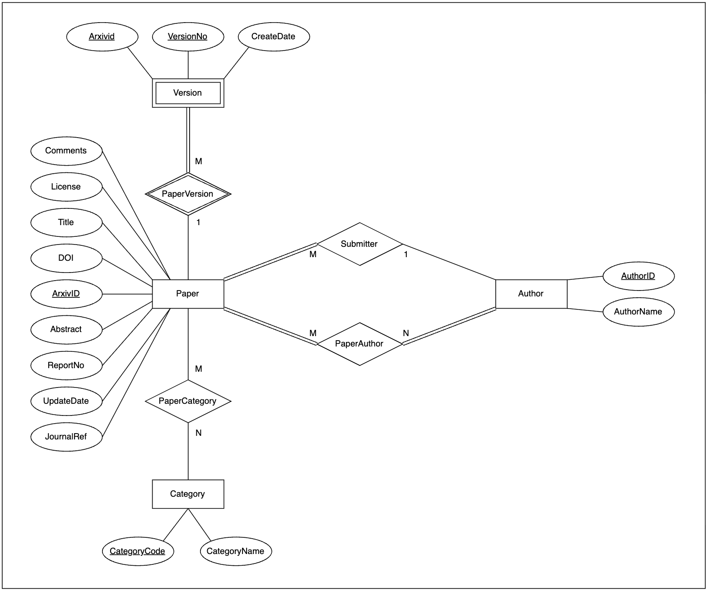
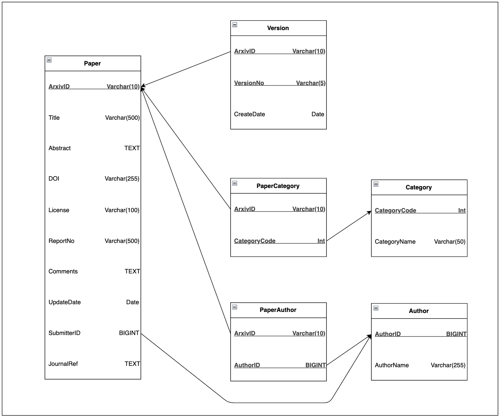

# DS604 Group Project

## Group Members
* 202518008 (Team Leader): Devam Gandhi
* 202518036: Kashyap S. Patel

## Milestones

* Milestone 1: Identify Dataset and Tentative List of Queries.
* Milestone 2: Create relevant schema to store the dataset and create
    * ER Diagram
    * Relational Schema Diagram
    * DDL Scripts
* Milestone 3: Upload dataset into the PostgreSQL database.
* Milestone 4: Execute analytical queries on postgresql server.
* Milestone 5: Save some of queries as Views.
* Final Submission

## Problem Statement, Dataset and Analytical Queries

### Problem Statement

**Title: Designing a Relational Database for Analyzing Research Collaboration and Publication Trends Using Scholarly Metadata from arXiv**

#### Objective

To design a relational database that stores and enables analysis of arXiv research paper data to discover insights about author collaborations, research category trends, and the evolution of publications over time.

### Dataset Description

**Link to Dataset:** https://huggingface.co/datasets/arxiv-community/arxiv_dataset, https://www.kaggle.com/datasets/Cornell-University/arxiv

The dataset contains about 2 million research papers collected from arXiv. Each paper record includes basic details such as paper ID, title, authors, abstract, and research categories. It also provides extra information like comments, journal references, DOIs, report numbers, and licenses (though many of these are missing for some papers). The dataset also includes the date when each paper was last updated, and structured details about versions and authors.

#### Sample Data Instance

```json
{
  "id": "0704.0001",
  "submitter": "Pavel Nadolsky",
  "authors": "C. Balázs, E. L. Berger, P. M. Nadolsky, C.-P. Yuan",
  "title": "Calculation of prompt diphoton production cross sections at Tevatron and LHC energies",
  "comments": "37 pages, 15 figures; published version",
  "journal-ref": "Phys.Rev.D76:013009,2007",
  "doi": "10.1103/PhysRevD.76.013009",
  "report-no": "ANL-HEP-PR-07-12",
  "categories": "hep-ph",
  "license": null,
  "abstract": "A fully differential calculation in perturbative quantum chromodynamics is presented for the production of massive photon pairs...",
  "versions": [
    { "version": "v1", "created": "Mon, 2 Apr 2007 19:18:42 GMT" },
    { "version": "v2", "created": "Tue, 24 Jul 2007 20:10:27 GMT" }
  ],
  "update_date": "2008-11-26",
  "authors_parsed": [
    ["Balázs", "C.", ""],
    ["Berger", "E. L.", ""],
    ["Nadolsky", "P. M.", ""],
    ["Yuan", "C.-P.", ""]
  ]
}
```

#### Data Fields

* **id:** ArXiv ID (can be used to access the paper)
* **submitter:** Who submitted the paper
* **authors:** Authors of the paper
* **title:** Title of the paper
* **comments:** Additional info, such as number of pages and figures
* **journal-ref:** Information about the journal the paper was published in
* **doi:** Digital Object Identifier
* **report-no:** Report Number
* **abstract:** The abstract of the paper
* **categories:** Categories / tags in the ArXiv system
* **versions:** A version history

### Analytical Queries

1. Average number of co-authors per paper across categories.
2. Average time between initial submission and last update.
3. Authors who frequently publish together.
4. Authors with the longest active publishing span.
5. Categories that frequently appear together.
6. Category-wise yearly publication count.
7. Keyword frequency (“deep learning”) by year.
8. Most common submission months/days.
9. Number of distinct categories per author.
10. Percentage of papers updated more than once.
11. Proportion of single-author vs multi-author papers.
12. Submitters who stop contributing after 5 years.
13. Top author by number of papers.
14. Top submitters by number of papers.

## ER Diagram and Relational Schema

### ER Diagram



### Relational Schema



## DDL Script

```sql
-- ============================================================
-- Table: author
-- Description: Stores information about all authors, including
--              their unique identifier and full name.
-- ============================================================
CREATE TABLE author (
    authorid BIGINT PRIMARY KEY,
    authorname VARCHAR(255) NOT NULL
);

-- ============================================================
-- Table: category
-- Description: Stores all research categories (subjects) from arXiv.
--              Each category has a unique code and descriptive name.
-- ============================================================
CREATE TABLE category (
    categorycode VARCHAR(30) PRIMARY KEY,
    categoryname VARCHAR(50) UNIQUE NOT NULL
);

-- ============================================================
-- Table: paper
-- Description: Contains details of each research paper including
--              title, abstract, metadata, and the author who submitted it.
-- Relationships:
--   * submitterid -> author(authorid)
-- ============================================================
CREATE TABLE paper (
    arxivid VARCHAR(10) PRIMARY KEY,
    title VARCHAR(500) NOT NULL,
    abstract TEXT NOT NULL,
    license VARCHAR(100),
    doi VARCHAR(255),
    reportno VARCHAR(500),
    journalref TEXT,
    comments TEXT,
    updatedate DATE,
    submitterid INT NOT NULL,
    FOREIGN KEY (submitterid) REFERENCES author(authorid)
);

-- ============================================================
-- Table: version
-- Description: Stores version history for each paper, including
--              version number and submission date.
-- Relationships:
--   * arxivid -> paper(arxivid)
-- ============================================================
CREATE TABLE version (
    arxivid VARCHAR(10) NOT NULL,
    versionno VARCHAR(5),
    createdate DATE,
    PRIMARY KEY (arxivid, versionno),
    FOREIGN KEY (arxivid) REFERENCES paper(arxivid)
);

-- ============================================================
-- Table: paperauthor
-- Description: Many-to-many mapping between papers and authors.
--              Represents all authors who contributed to each paper.
-- Relationships:
--   * arxivid -> paper(arxivid)
--   * authorid -> author(authorid)
-- ============================================================
CREATE TABLE paperauthor (
    arxivid VARCHAR(10),
    authorid INT,
    PRIMARY KEY (arxivid, authorid),
    FOREIGN KEY (arxivid) REFERENCES paper(arxivid),
    FOREIGN KEY (authorid) REFERENCES author(authorid)
);

-- ============================================================
-- Table: papercategory
-- Description: Many-to-many mapping between papers and research categories.
--              Represents all subject areas a paper belongs to.
-- Relationships:
--   * arxivid -> paper(arxivid)
--   * categorycode -> category(categorycode)
-- ============================================================
CREATE TABLE papercategory (
    arxivid VARCHAR(10),
    categorycode VARCHAR(30),
    PRIMARY KEY (arxivid, categorycode),
    FOREIGN KEY (arxivid) REFERENCES paper(arxivid),
    FOREIGN KEY (categorycode) REFERENCES category(categorycode)
);
```

## Analytical Queries

1. Average Number of Co-authors per Paper Across Categories

```sql
SELECT 
    categoryname,
    AVG(author_count) AS avg_coauthors
FROM (
    SELECT 
        categorycode,
        COUNT(authorid) AS author_count
    FROM paperauthor
    NATURAL JOIN papercategory
    GROUP BY categorycode, arxivid
) sub
NATURAL JOIN category
GROUP BY categoryname
ORDER BY avg_coauthors DESC;
```

2. Average Time Between Initial Submission and Last Update

```sql
SELECT 
    AVG(last_update - first_submit) AS avg_days_between
FROM (
    SELECT 
        arxivid,
        MIN(createdate) AS first_submit,
        MAX(createdate) AS last_update
    FROM version
    GROUP BY arxivid
) v;
```

3. Authors Who Frequently Publish Together

```sql
SELECT 
    a1.authorid AS author1_id,
    a1.authorname AS author1_name,
    a2.authorid AS author2_id,
    a2.authorname AS author2_name,
    COUNT(*) AS papers_together
FROM paperauthor pa1
JOIN paperauthor pa2
    ON pa1.arxivid = pa2.arxivid 
    AND pa1.authorid < pa2.authorid
JOIN author a1 ON pa1.authorid = a1.authorid
JOIN author a2 ON pa2.authorid = a2.authorid
GROUP BY a1.authorid, a1.authorname, a2.authorid, a2.authorname
HAVING COUNT(*) > 3
ORDER BY papers_together DESC;
```

4. Authors with the Longest Active Publishing Span

```sql
SELECT 
    authorid,
    authorname,
    MIN(EXTRACT(YEAR FROM updatedate)) AS first_year,
    MAX(EXTRACT(YEAR FROM updatedate)) AS last_year,
    (MAX(EXTRACT(YEAR FROM updatedate)) - MIN(EXTRACT(YEAR FROM updatedate))) AS active_years
FROM author
NATURAL JOIN paperauthor
NATURAL JOIN paper
GROUP BY authorid, authorname
ORDER BY active_years DESC;
```

5. Categories That Frequently Appear Together

```sql
SELECT 
    c1.categorycode AS cat1_code,
    c1.categoryname AS cat1_name,
    c2.categorycode AS cat2_code,
    c2.categoryname AS cat2_name,
    COUNT(*) AS co_occurrence
FROM papercategory pc1
JOIN papercategory pc2 
    ON pc1.arxivid = pc2.arxivid 
   AND pc1.categorycode < pc2.categorycode
JOIN category c1 ON pc1.categorycode = c1.categorycode
JOIN category c2 ON pc2.categorycode = c2.categorycode
GROUP BY c1.categorycode, c1.categoryname, c2.categorycode, c2.categoryname
ORDER BY co_occurrence DESC;
```

6. Category-wise Yearly Publication Count

```sql
SELECT
    categoryname,
    EXTRACT(YEAR FROM updatedate) AS year,
    COUNT(DISTINCT arxivid) AS papers_published
FROM category
NATURAL JOIN papercategory
NATURAL JOIN paper
GROUP BY categoryname, year
ORDER BY categoryname, year;
```

7. Keyword Frequency ("Deep Learning") by Year

```sql
SELECT
    EXTRACT(YEAR FROM updatedate) AS year,
    COUNT(*) AS mentions
FROM paper
WHERE LOWER(abstract) LIKE '%deep learning%'
GROUP BY year
ORDER BY year;
```

8(a). Most Common Submission Months

```sql
SELECT 
    TO_CHAR(createdate, 'Month') AS month_name,
    COUNT(*) AS submissions
FROM version
GROUP BY month_name
ORDER BY submissions DESC;
```

8(b). Most Common Submission Days

```sql
SELECT 
    TO_CHAR(createdate, 'Day') AS day_name,
    COUNT(*) AS submissions
FROM version
GROUP BY day_name
ORDER BY submissions DESC;
```

9. Number of Distinct Categories per Author

```sql
SELECT 
    authorid,
    authorname,
    COUNT(DISTINCT categorycode) AS distinct_categories
FROM author
NATURAL JOIN paperauthor
NATURAL JOIN papercategory
GROUP BY authorid, authorname
ORDER BY distinct_categories DESC;
```

10. Percentage of Papers Updated More Than Once

```sql
SELECT 
    ROUND(100.0 * SUM(CASE WHEN version_count > 1 THEN 1 ELSE 0 END) / COUNT(*), 2) AS percent_multi_updated
FROM (
    SELECT arxivid, COUNT(*) AS version_count
    FROM version
    GROUP BY arxivid
) sub;
```

11. Proportion of Single-Author vs Multi-Author Papers

```sql
SELECT 
    CASE 
        WHEN author_count = 1 THEN 'Single Author' 
        ELSE 'Multi Author' 
    END AS paper_type,
    COUNT(*) AS num_papers,
    ROUND(100.0 * COUNT(*) / SUM(COUNT(*)) OVER (), 2) AS percentage
FROM (
    SELECT arxivid, COUNT(authorid) AS author_count
    FROM paperauthor
    GROUP BY arxivid
) sub
GROUP BY paper_type;
```

12. Submitters Who Stop Contributing After 5 Years

```sql
SELECT 
    a.authorid,
    a.authorname,
    MAX(EXTRACT(YEAR FROM p.updatedate)) AS last_year
FROM author a
JOIN paper p ON a.authorid = p.submitterid
GROUP BY a.authorid, a.authorname
HAVING MAX(EXTRACT(YEAR FROM p.updatedate)) < EXTRACT(YEAR FROM CURRENT_DATE) - 5
ORDER BY last_year DESC;
```

13. Top Author by Number of Papers

```sql
SELECT 
    authorid,
    authorname,
    COUNT(arxivid) AS total_papers_coauthored
FROM paperauthor
NATURAL JOIN author
GROUP BY authorid, authorname
ORDER BY total_papers_coauthored DESC;
```

14. Top Submitters by Number of Papers

```sql
SELECT 
    a.authorid,
    a.authorname,
    COUNT(p.arxivid) AS total_submissions
FROM author a
JOIN paper p ON a.authorid = p.submitterid
GROUP BY a.authorid, a.authorname
ORDER BY total_submissions DESC;
```

## Queries as Views

### Views

#### Frequent Collaborators
```sql
CREATE MATERIALIZED VIEW mv_frequent_collaborators AS
SELECT
    a1.authorid AS author1_id,
    a1.authorname AS author1_name,
    a2.authorid AS author2_id,
    a2.authorname AS author2_name,
    COUNT(*) AS papers_together
FROM paperauthor pa1
JOIN paperauthor pa2
    ON pa1.arxivid = pa2.arxivid AND pa1.authorid < pa2.authorid
JOIN author a1 ON pa1.authorid = a1.authorid
JOIN author a2 ON pa2.authorid = a2.authorid
GROUP BY a1.authorid, a1.authorname, a2.authorid, a2.authorname;
```

#### Paper and All Metadata Combined
```sql
CREATE MATERIALIZED VIEW mv_paper_full AS
SELECT
    p.arxivid,
    p.title,
    p.abstract,
    p.updatedate,
    p.submitterid,
    a.authorname AS submitter_name,
    categorycode,
    categoryname
FROM paper p
JOIN author a ON p.submitterid = a.authorid
NATURAL JOIN papercategory
NATURAL JOIN category;
```

### Queries

#### All authors who frequently collaborated with `Yoshua Bengio`, sorted by the number of papers they co-authored together.

```sql
SELECT author1_name, author2_name, papers_together
FROM mv_frequent_collaborators
WHERE author1_name = :name
ORDER BY papers_together DESC;
```

#### Authors publishing the most deep learning papers.
```sql
SELECT
    authorid,
    authorname,
    COUNT(DISTINCT arxivid) AS deep_learning_papers
FROM mv_paper_full
NATURAL JOIN paperauthor
NATURAL JOIN author
WHERE 
    (LOWER(title) LIKE '%deep learning%' 
    OR LOWER(abstract) LIKE '%deep learning%')
    AND categorycode IN ('cs.AI', 'cs.CL', 'cs.CV', 'cs.LG', 'cs.IR', 'cs.NE')
GROUP BY authorid, authorname
ORDER BY deep_learning_papers DESC;
```
